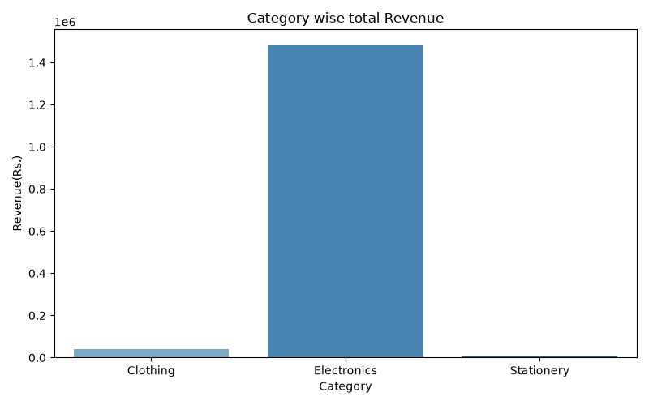
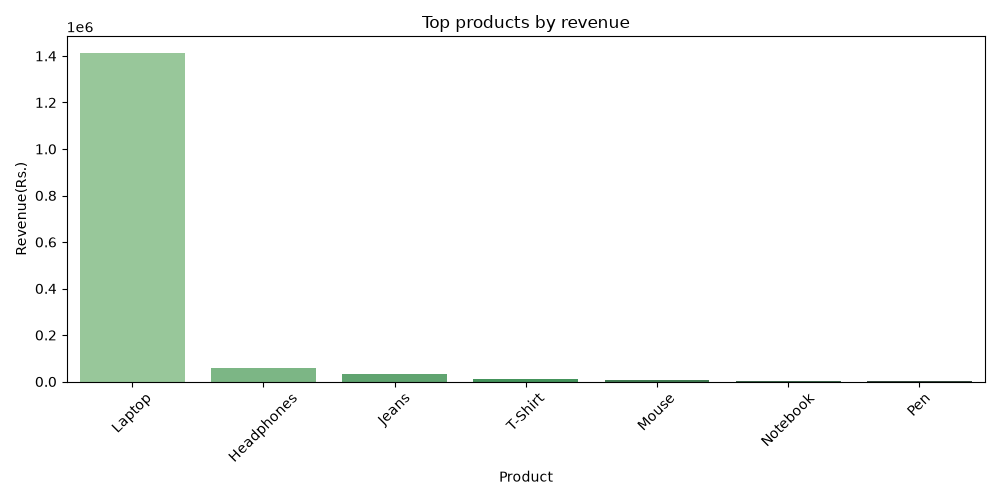
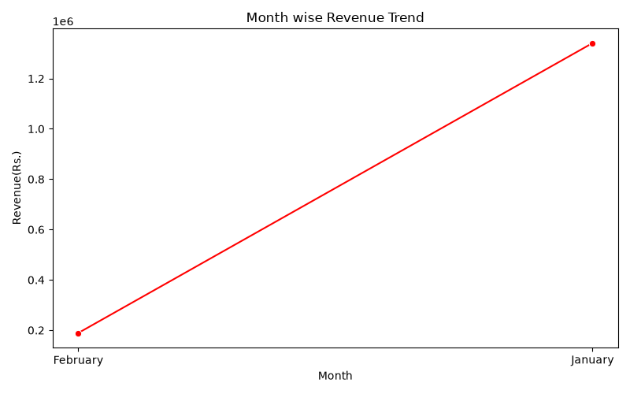

# E-Commerce Sales Data Analysis

A data analysis project using Python to analyze e-commerce sales data, 
identify trends, and visualize insights using Pandas, Matplotlib, and Seaborn.

## Key Insights
- Electronics is the highest revenue-generating category (₹14.8 Lakhs)
- Laptop alone contributed 95% of Electronics revenue
- January had higher sales than February

## Features
- Data loading from CSV
- Data cleaning (missing values handled, duplicates removed)
- Revenue analysis by Category, Product, and Month
- Interactive visualizations with bar and line charts

## Technologies Used
- Python
- Pandas (data manipulation & cleaning)
- Matplotlib (visualization)
- Seaborn (advanced charts)

## Steps Performed
1. Loaded raw sales data from CSV
2. Explored data (shape, types, missing values)
3. Cleaned data (filled missing values with mean, removed duplicates)
4. Created Revenue column (Quantity × Price)
5. Analyzed revenue by Category, Product, and Month
6. Visualized insights with 3 charts

## Charts
### Category wise Revenue


### Product wise Revenue


### Month wise Revenue Trend


## How to Run
```
pip install pandas matplotlib seaborn
python sales_analycis.py
```
